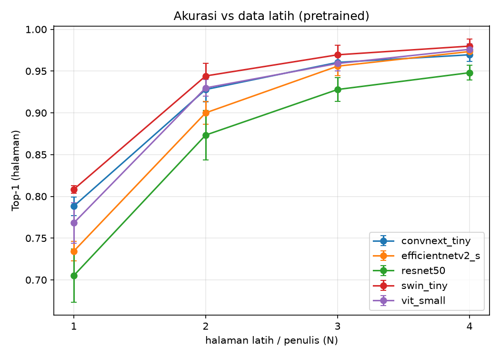

# Hasil Eksperimen — Perbandingan Arsitektur Writer-ID CVL

_Dibuat 2026-08-08 15:25 dari `results/results-pretrained.csv` (100 run)._

## Mode: pretrained (transfer learning)

Hasil utama. Ablasi ukuran data latih L1–L4.

### Top-1 (halaman)

| arch | N=1 | N=2 | N=3 | N=4 |
|---|---|---|---|---|
| convnext_tiny | 0.788±0.011 | 0.928±0.015 | 0.960±0.010 | 0.969±0.008 |
| efficientnetv2_s | 0.734±0.012 | 0.900±0.014 | 0.956±0.011 | 0.973±0.004 |
| resnet50 | 0.705±0.032 | 0.873±0.030 | 0.928±0.014 | 0.948±0.009 |
| swin_tiny | 0.808±0.005 | 0.944±0.015 | 0.969±0.011 | 0.980±0.008 |
| vit_small | 0.768±0.024 | 0.930±0.010 | 0.959±0.009 | 0.976±0.007 |

### Top-5 (halaman)

| arch | N=1 | N=2 | N=3 | N=4 |
|---|---|---|---|---|
| convnext_tiny | 0.927±0.008 | 0.977±0.005 | 0.984±0.005 | 0.990±0.004 |
| efficientnetv2_s | 0.893±0.009 | 0.971±0.009 | 0.986±0.005 | 0.990±0.002 |
| resnet50 | 0.892±0.014 | 0.963±0.005 | 0.983±0.007 | 0.984±0.004 |
| swin_tiny | 0.921±0.006 | 0.978±0.003 | 0.986±0.003 | 0.990±0.001 |
| vit_small | 0.910±0.010 | 0.975±0.006 | 0.988±0.004 | 0.989±0.002 |

### Macro-F1 (halaman)

| arch | N=1 | N=2 | N=3 | N=4 |
|---|---|---|---|---|
| convnext_tiny | 0.736±0.012 | 0.905±0.019 | 0.947±0.013 | 0.960±0.011 |
| efficientnetv2_s | 0.671±0.014 | 0.871±0.019 | 0.942±0.015 | 0.965±0.005 |
| resnet50 | 0.641±0.035 | 0.838±0.037 | 0.905±0.019 | 0.931±0.011 |
| swin_tiny | 0.759±0.008 | 0.927±0.019 | 0.960±0.015 | 0.973±0.011 |
| vit_small | 0.710±0.028 | 0.909±0.013 | 0.946±0.011 | 0.968±0.009 |

### mAP (retrieval, baris)

| arch | N=1 | N=2 | N=3 | N=4 |
|---|---|---|---|---|
| convnext_tiny | 0.263±0.006 | 0.384±0.006 | 0.457±0.007 | 0.500±0.018 |
| efficientnetv2_s | 0.222±0.010 | 0.350±0.014 | 0.428±0.020 | 0.500±0.010 |
| resnet50 | 0.219±0.006 | 0.298±0.005 | 0.345±0.010 | 0.377±0.002 |
| swin_tiny | 0.283±0.010 | 0.398±0.011 | 0.456±0.012 | 0.499±0.007 |
| vit_small | 0.249±0.007 | 0.356±0.010 | 0.427±0.004 | 0.470±0.003 |

### Efisiensi (rata-rata lintas level/seed)

| arch | n_params | throughput_img_s | train_time_s |
|---|---|---|---|
| convnext_tiny | 28056980.000 | 157.169 | 1642.931 |
| efficientnetv2_s | 20572036.000 | 160.088 | 1611.166 |
| resnet50 | 24139124.000 | 158.917 | 1675.017 |
| swin_tiny | 27756206.000 | 151.869 | 1755.079 |
| vit_small | 21784244.000 | 155.294 | 1738.168 |

## Mode: scratch (dari nol) — trainability

Dilatih dari inisialisasi acak dengan resep sama (LR warmup=3) untuk SEMUA arsitektur. Dilaporkan hanya pada **L4** (data latih terbanyak, kondisi terbaik untuk scratch); data lebih sedikit hanya memperparah. Kolom **kolaps** = jumlah seed dengan top-1 < 0.05 (prediksi ~1 kelas).

### Top-1 per seed @ L4

| arch |  | rerata | kolaps |
|---|---|---|

### Macro-F1 per seed @ L4

| arch |  | rerata | kolaps |
|---|---|---|

> Swin-Tiny (kolaps 3/3) dan ConvNeXt-Tiny (kolaps 2/3) gagal konvergen dari scratch bahkan dengan warmup + data L4, sementara CNN (ResNet, EfficientNet) dan ViT tidak pernah kolaps (0/3). Arsitektur hierarkis modern menuntut pretraining pada skala dataset ini.
