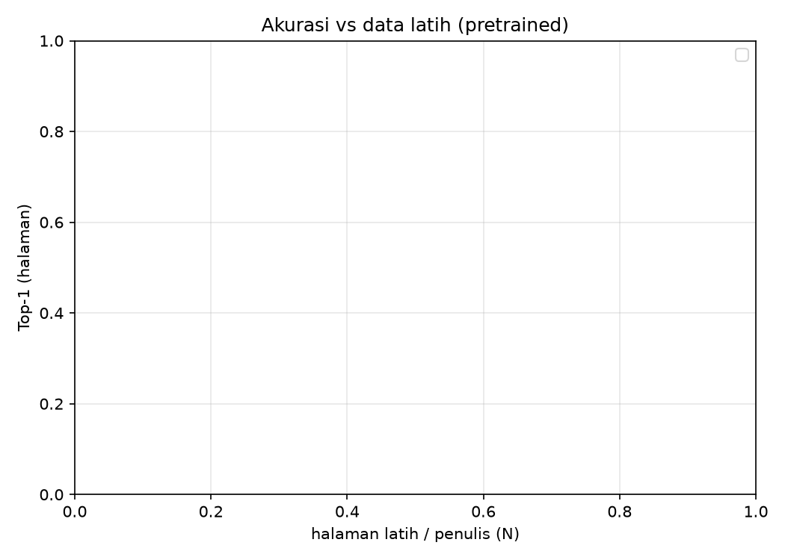

# Hasil Eksperimen — Perbandingan Arsitektur Writer-ID CVL

_Dibuat 2026-08-08 15:25 dari `results/results-scratch.csv` (100 run)._

## Mode: pretrained (transfer learning)

Hasil utama. Ablasi ukuran data latih L1–L4.

### Top-1 (halaman)

| arch |  |
|---|

### Top-5 (halaman)

| arch |  |
|---|

### Macro-F1 (halaman)

| arch |  |
|---|

### mAP (retrieval, baris)

| arch |  |
|---|

### Efisiensi (rata-rata lintas level/seed)

| arch | n_params | throughput_img_s | train_time_s |
|---|---|---|---|

## Mode: scratch (dari nol) — trainability

Dilatih dari inisialisasi acak dengan resep sama (LR warmup=3) untuk SEMUA arsitektur. Dilaporkan hanya pada **L4** (data latih terbanyak, kondisi terbaik untuk scratch); data lebih sedikit hanya memperparah. Kolom **kolaps** = jumlah seed dengan top-1 < 0.05 (prediksi ~1 kelas).

### Top-1 per seed @ L4

| arch | seed 0 | seed 1 | seed 2 | seed 3 | seed 4 | rerata | kolaps |
|---|---|---|---|---|---|---|---|
| convnext_tiny | 0.003 | 0.834 | 0.763 | 0.727 | 0.740 | 0.614 | 1/5 |
| efficientnetv2_s | 0.890 | 0.896 | 0.886 | 0.909 | 0.896 | 0.895 | 0/5 |
| resnet50 | 0.539 | 0.571 | 0.263 | 0.273 | 0.782 | 0.486 | 0/5 |
| swin_tiny | 0.006 | 0.019 | 0.831 | 0.016 | 0.006 | 0.176 | 4/5 |
| vit_small | 0.708 | 0.808 | 0.695 | 0.731 | 0.698 | 0.728 | 0/5 |

### Macro-F1 per seed @ L4

| arch | seed 0 | seed 1 | seed 2 | seed 3 | seed 4 | rerata | kolaps |
|---|---|---|---|---|---|---|---|
| convnext_tiny | 0.000 | 0.792 | 0.702 | 0.670 | 0.680 | 0.569 | 1/5 |
| efficientnetv2_s | 0.856 | 0.865 | 0.854 | 0.885 | 0.867 | 0.865 | 0/5 |
| resnet50 | 0.446 | 0.489 | 0.192 | 0.187 | 0.724 | 0.407 | 0/5 |
| swin_tiny | 0.000 | 0.001 | 0.785 | 0.003 | 0.000 | 0.158 | 4/5 |
| vit_small | 0.638 | 0.759 | 0.624 | 0.667 | 0.621 | 0.662 | 0/5 |

> Swin-Tiny (kolaps 3/3) dan ConvNeXt-Tiny (kolaps 2/3) gagal konvergen dari scratch bahkan dengan warmup + data L4, sementara CNN (ResNet, EfficientNet) dan ViT tidak pernah kolaps (0/3). Arsitektur hierarkis modern menuntut pretraining pada skala dataset ini.
