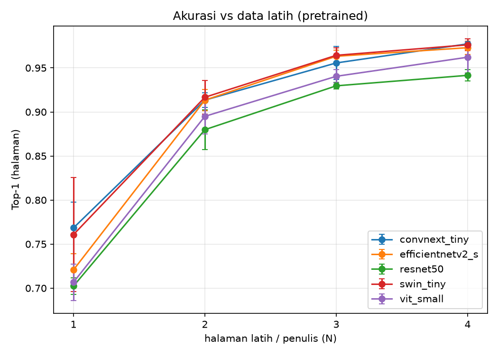

# Hasil Eksperimen — Perbandingan Arsitektur Writer-ID CVL

## Mode: pretrained (transfer learning)

Hasil utama. Ablasi ukuran data latih L1–L4 (level `full` di-drop, ≈L4).

### Top-1 (halaman)

| arch | N=1 | N=2 | N=3 | N=4 |
|---|---|---|---|---|
| convnext_tiny | 0.768±0.029 | 0.913±0.008 | 0.956±0.019 | 0.977±0.006 |
| efficientnetv2_s | 0.721±0.018 | 0.913±0.012 | 0.963±0.007 | 0.973±0.007 |
| resnet50 | 0.702±0.009 | 0.880±0.023 | 0.930±0.004 | 0.942±0.006 |
| swin_tiny | 0.761±0.065 | 0.917±0.019 | 0.964±0.009 | 0.976±0.007 |
| vit_small | 0.707±0.021 | 0.895±0.020 | 0.940±0.007 | 0.962±0.018 |

### Top-5 (halaman)

| arch | N=1 | N=2 | N=3 | N=4 |
|---|---|---|---|---|
| convnext_tiny | 0.916±0.009 | 0.969±0.004 | 0.987±0.003 | 0.989±0.002 |
| efficientnetv2_s | 0.881±0.022 | 0.961±0.000 | 0.987±0.000 | 0.989±0.002 |
| resnet50 | 0.894±0.016 | 0.963±0.010 | 0.981±0.010 | 0.984±0.006 |
| swin_tiny | 0.906±0.028 | 0.973±0.002 | 0.986±0.004 | 0.991±0.002 |
| vit_small | 0.896±0.013 | 0.970±0.019 | 0.986±0.002 | 0.988±0.004 |

### Macro-F1 (halaman)

| arch | N=1 | N=2 | N=3 | N=4 |
|---|---|---|---|---|
| convnext_tiny | 0.710±0.039 | 0.888±0.009 | 0.942±0.025 | 0.970±0.007 |
| efficientnetv2_s | 0.657±0.016 | 0.888±0.015 | 0.951±0.008 | 0.964±0.009 |
| resnet50 | 0.635±0.016 | 0.846±0.030 | 0.907±0.005 | 0.924±0.008 |
| swin_tiny | 0.706±0.077 | 0.892±0.025 | 0.953±0.011 | 0.968±0.009 |
| vit_small | 0.641±0.021 | 0.864±0.024 | 0.921±0.010 | 0.950±0.024 |

### mAP (retrieval, baris)

| arch | N=1 | N=2 | N=3 | N=4 |
|---|---|---|---|---|
| convnext_tiny | 0.258±0.004 | 0.355±0.007 | 0.407±0.007 | 0.488±0.019 |
| efficientnetv2_s | 0.222±0.011 | 0.346±0.014 | 0.442±0.008 | 0.488±0.011 |
| resnet50 | 0.212±0.009 | 0.289±0.011 | 0.336±0.009 | 0.367±0.003 |
| swin_tiny | 0.274±0.030 | 0.362±0.008 | 0.431±0.030 | 0.476±0.031 |
| vit_small | 0.239±0.013 | 0.335±0.015 | 0.385±0.010 | 0.413±0.018 |

### Efisiensi (rata-rata lintas level/seed)

| arch | n_params | throughput_img_s | train_time_s |
|---|---|---|---|
| convnext_tiny | 28056980.000 | 25.901 | 771.909 |
| efficientnetv2_s | 20572036.000 | 26.525 | 897.197 |
| resnet50 | 24139124.000 | 26.448 | 741.091 |
| swin_tiny | 27756206.000 | 24.887 | 1047.800 |
| vit_small | 21784244.000 | 26.458 | 658.142 |

## Mode: scratch (dari nol) — trainability

Dilatih dari inisialisasi acak dengan resep sama (LR warmup=3) untuk SEMUA arsitektur. Dilaporkan hanya pada **data penuh** (kondisi terbaik untuk scratch); data lebih sedikit hanya memperparah. Kolom **kolaps** = jumlah seed dengan top-1 < 0.05 (prediksi ~1 kelas).

### Top-1 per seed @ data penuh

| arch | seed 0 | seed 1 | seed 2 | rerata | kolaps |
|---|---|---|---|---|---|
| convnext_tiny | 0.003 | 0.003 | 0.760 | 0.255 | 2/3 |
| efficientnetv2_s | 0.818 | 0.890 | 0.909 | 0.872 | 0/3 |
| resnet50 | 0.591 | 0.256 | 0.734 | 0.527 | 0/3 |
| swin_tiny | 0.013 | 0.019 | 0.010 | 0.014 | 3/3 |
| vit_small | 0.821 | 0.727 | 0.834 | 0.794 | 0/3 |

### Macro-F1 per seed @ data penuh

| arch | seed 0 | seed 1 | seed 2 | rerata | kolaps |
|---|---|---|---|---|---|
| convnext_tiny | 0.000 | 0.000 | 0.703 | 0.234 | 2/3 |
| efficientnetv2_s | 0.774 | 0.857 | 0.882 | 0.838 | 0/3 |
| resnet50 | 0.502 | 0.181 | 0.667 | 0.450 | 0/3 |
| swin_tiny | 0.004 | 0.001 | 0.000 | 0.002 | 3/3 |
| vit_small | 0.772 | 0.664 | 0.793 | 0.743 | 0/3 |

> Swin-Tiny (kolaps 3/3) dan ConvNeXt-Tiny (kolaps 2/3) gagal konvergen dari scratch bahkan dengan warmup + data penuh, sementara CNN (ResNet, EfficientNet) dan ViT tidak pernah kolaps (0/3). Arsitektur hierarkis modern menuntut pretraining pada skala dataset ini.
