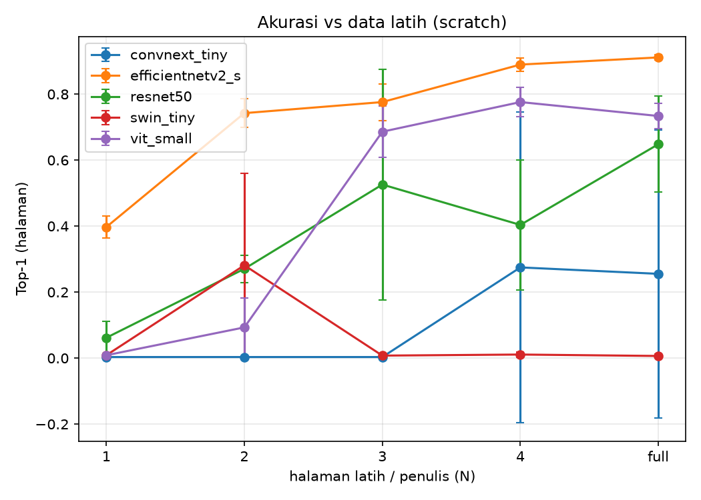

# Hasil Eksperimen — Perbandingan Arsitektur Writer-ID CVL

## Mode: pretrained

### Top-1 (halaman)

| arch | N=1 | N=2 | N=3 | N=4 | N=full |
|---|---|---|---|---|---|
| convnext_tiny | 0.768±0.029 | 0.913±0.008 | 0.956±0.019 | 0.977±0.006 | 0.973±0.007 |
| efficientnetv2_s | 0.721±0.018 | 0.913±0.012 | 0.963±0.007 | 0.973±0.007 | 0.979±0.005 |
| resnet50 | 0.702±0.009 | 0.880±0.023 | 0.930±0.004 | 0.942±0.006 | 0.951±0.013 |
| swin_tiny | 0.761±0.065 | 0.917±0.019 | 0.964±0.009 | 0.976±0.007 | 0.977±0.000 |
| vit_small | 0.707±0.021 | 0.895±0.020 | 0.940±0.007 | 0.962±0.018 | 0.970±0.008 |

### Top-5 (halaman)

| arch | N=1 | N=2 | N=3 | N=4 | N=full |
|---|---|---|---|---|---|
| convnext_tiny | 0.916±0.009 | 0.969±0.004 | 0.987±0.003 | 0.989±0.002 | 0.991±0.002 |
| efficientnetv2_s | 0.881±0.022 | 0.961±0.000 | 0.987±0.000 | 0.989±0.002 | 0.991±0.002 |
| resnet50 | 0.894±0.016 | 0.963±0.010 | 0.981±0.010 | 0.984±0.006 | 0.983±0.004 |
| swin_tiny | 0.906±0.028 | 0.973±0.002 | 0.986±0.004 | 0.991±0.002 | 0.989±0.002 |
| vit_small | 0.896±0.013 | 0.970±0.019 | 0.986±0.002 | 0.988±0.004 | 0.989±0.002 |

### Macro-F1 (halaman)

| arch | N=1 | N=2 | N=3 | N=4 | N=full |
|---|---|---|---|---|---|
| convnext_tiny | 0.710±0.039 | 0.888±0.009 | 0.942±0.025 | 0.970±0.007 | 0.964±0.009 |
| efficientnetv2_s | 0.657±0.016 | 0.888±0.015 | 0.951±0.008 | 0.964±0.009 | 0.973±0.006 |
| resnet50 | 0.635±0.016 | 0.846±0.030 | 0.907±0.005 | 0.924±0.008 | 0.936±0.017 |
| swin_tiny | 0.706±0.077 | 0.892±0.025 | 0.953±0.011 | 0.968±0.009 | 0.970±0.000 |
| vit_small | 0.641±0.021 | 0.864±0.024 | 0.921±0.010 | 0.950±0.024 | 0.960±0.011 |

### mAP (retrieval, baris)

| arch | N=1 | N=2 | N=3 | N=4 | N=full |
|---|---|---|---|---|---|
| convnext_tiny | 0.258±0.004 | 0.355±0.007 | 0.407±0.007 | 0.488±0.019 | 0.453±0.007 |
| efficientnetv2_s | 0.222±0.011 | 0.346±0.014 | 0.442±0.008 | 0.488±0.011 | 0.501±0.011 |
| resnet50 | 0.212±0.009 | 0.289±0.011 | 0.336±0.009 | 0.367±0.003 | 0.371±0.003 |
| swin_tiny | 0.274±0.030 | 0.362±0.008 | 0.431±0.030 | 0.476±0.031 | 0.459±0.032 |
| vit_small | 0.239±0.013 | 0.335±0.015 | 0.385±0.010 | 0.413±0.018 | 0.434±0.005 |

### Efisiensi (rata-rata lintas level/seed)

| arch | n_params | throughput_img_s | train_time_s |
|---|---|---|---|
| convnext_tiny | 28056980.000 | 25.901 | 771.909 |
| efficientnetv2_s | 20572036.000 | 26.525 | 897.197 |
| resnet50 | 24139124.000 | 26.448 | 741.091 |
| swin_tiny | 27756206.000 | 24.887 | 1047.800 |
| vit_small | 21784244.000 | 26.458 | 658.142 |

## Mode: scratch

### Top-1 (halaman)

| arch | N=1 | N=2 | N=3 | N=4 | N=full |
|---|---|---|---|---|---|
| convnext_tiny | 0.003±0.000 | 0.003±0.000 | 0.003±0.000 | 0.275±0.471 | 0.255±0.437 |
| efficientnetv2_s | 0.397±0.033 | 0.742±0.044 | 0.776±0.055 | 0.890±0.020 | 0.911±0.008 |
| resnet50 | 0.062±0.050 | 0.271±0.041 | 0.526±0.350 | 0.404±0.197 | 0.648±0.145 |
| swin_tiny | 0.009±0.005 | 0.281±0.278 | 0.008±0.005 | 0.011±0.007 | 0.006±0.006 |
| vit_small | 0.009±0.002 | 0.093±0.090 | 0.686±0.077 | 0.776±0.044 | 0.734±0.039 |

### Top-5 (halaman)

| arch | N=1 | N=2 | N=3 | N=4 | N=full |
|---|---|---|---|---|---|
| convnext_tiny | 0.016±0.000 | 0.017±0.002 | 0.019±0.006 | 0.326±0.536 | 0.316±0.519 |
| efficientnetv2_s | 0.686±0.010 | 0.900±0.015 | 0.936±0.019 | 0.968±0.011 | 0.975±0.008 |
| resnet50 | 0.194±0.137 | 0.580±0.073 | 0.737±0.311 | 0.715±0.165 | 0.902±0.050 |
| swin_tiny | 0.035±0.018 | 0.491±0.409 | 0.032±0.014 | 0.047±0.015 | 0.031±0.021 |
| vit_small | 0.048±0.023 | 0.281±0.224 | 0.886±0.029 | 0.902±0.018 | 0.907±0.025 |

### Macro-F1 (halaman)

| arch | N=1 | N=2 | N=3 | N=4 | N=full |
|---|---|---|---|---|---|
| convnext_tiny | 0.000±0.000 | 0.000±0.000 | 0.000±0.000 | 0.257±0.445 | 0.235±0.407 |
| efficientnetv2_s | 0.328±0.025 | 0.682±0.049 | 0.722±0.066 | 0.858±0.026 | 0.886±0.010 |
| resnet50 | 0.028±0.026 | 0.195±0.033 | 0.462±0.366 | 0.324±0.185 | 0.574±0.165 |
| swin_tiny | 0.001±0.000 | 0.222±0.239 | 0.001±0.001 | 0.001±0.001 | 0.001±0.002 |
| vit_small | 0.001±0.000 | 0.050±0.059 | 0.620±0.082 | 0.718±0.051 | 0.666±0.047 |

### mAP (retrieval, baris)

| arch | N=1 | N=2 | N=3 | N=4 | N=full |
|---|---|---|---|---|---|
| convnext_tiny | 0.012±0.001 | 0.013±0.002 | 0.013±0.002 | 0.058±0.078 | 0.052±0.066 |
| efficientnetv2_s | 0.124±0.012 | 0.196±0.008 | 0.246±0.005 | 0.290±0.013 | 0.307±0.014 |
| resnet50 | 0.070±0.033 | 0.145±0.018 | 0.209±0.072 | 0.209±0.043 | 0.263±0.044 |
| swin_tiny | 0.014±0.002 | 0.070±0.053 | 0.011±0.004 | 0.015±0.001 | 0.012±0.001 |
| vit_small | 0.018±0.004 | 0.045±0.027 | 0.147±0.026 | 0.179±0.017 | 0.165±0.011 |

### Efisiensi (rata-rata lintas level/seed)

| arch | n_params | throughput_img_s | train_time_s |
|---|---|---|---|
| convnext_tiny | 28056980.000 | 26.252 | 541.426 |
| efficientnetv2_s | 20572036.000 | 26.622 | 1307.924 |
| resnet50 | 24139124.000 | 26.575 | 583.832 |
| swin_tiny | 27756206.000 | 24.797 | 495.170 |
| vit_small | 21784244.000 | 26.682 | 1325.399 |

