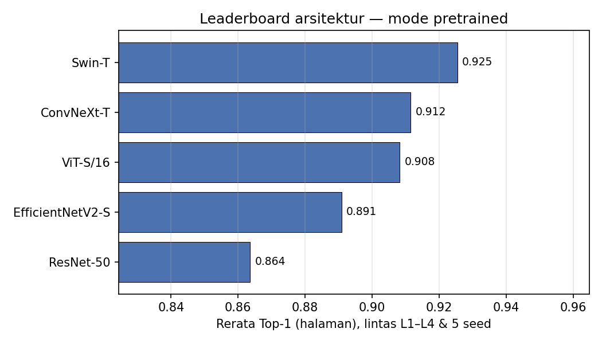
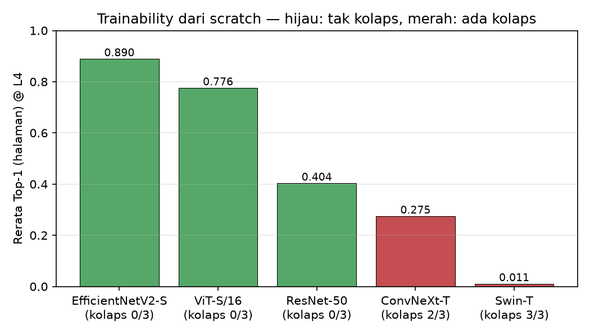

# Pembahasan Hasil & Tabel

Dokumen ini berisi paragraf pembahasan siap-pakai untuk skripsi. Tiap tabel
ditampilkan dalam bentuk **Markdown** (agar terbaca langsung di GitHub) dan
kode **LaTeX** (gaya `booktabs`, di dalam blok lipat "Kode LaTeX" untuk disalin
ke naskah skripsi — butuh `\usepackage{booktabs}`). Angka dihitung langsung dari
`results/results.csv` (rerata 3 seed; simpangan baku = sampel/ddof=1, konsisten
dengan `08-hasil-eksperimen.md`).

---

## 1. Transfer learning (pretrained)

### 1.1 Tabel hasil

**Tabel 1.** Akurasi Top-1 (halaman) mode *pretrained* per level data latih ($N$),
rerata $\pm$ simpangan baku atas 3 seed. Nilai terbaik tiap kolom **ditebalkan**.

| Arsitektur | N=1 | N=2 | N=3 | N=4 |
|---|---|---|---|---|
| ResNet-50 | 0.702±0.009 | 0.880±0.023 | 0.930±0.004 | 0.942±0.006 |
| EfficientNetV2-S | 0.721±0.018 | 0.913±0.012 | 0.963±0.007 | 0.973±0.007 |
| ViT-S/16 | 0.707±0.021 | 0.895±0.020 | 0.940±0.007 | 0.962±0.018 |
| Swin-T | 0.761±0.065 | **0.917±0.019** | **0.964±0.009** | 0.976±0.007 |
| ConvNeXt-T | **0.768±0.029** | 0.913±0.008 | 0.956±0.019 | **0.977±0.006** |

<details>
<summary>Kode LaTeX (Tabel 1)</summary>

```latex
\begin{table}[t]\centering
\caption{Akurasi Top-1 (halaman) mode \emph{pretrained} pada berbagai ukuran
data latih ($N$ = level ablasi), rerata $\pm$ simpangan baku atas 3 seed.
Nilai terbaik tiap kolom \textbf{ditebalkan}.}
\label{tab:pretrained-top1}
\begin{tabular}{lcccc}
\toprule
Arsitektur & $N{=}1$ & $N{=}2$ & $N{=}3$ & $N{=}4$ \\
\midrule
ResNet-50        & 0.702$\pm$0.009 & 0.880$\pm$0.023 & 0.930$\pm$0.004 & 0.942$\pm$0.006 \\
EfficientNetV2-S & 0.721$\pm$0.018 & 0.913$\pm$0.012 & 0.963$\pm$0.007 & 0.973$\pm$0.007 \\
ViT-S/16         & 0.707$\pm$0.021 & 0.895$\pm$0.020 & 0.940$\pm$0.007 & 0.962$\pm$0.018 \\
Swin-T           & 0.761$\pm$0.065 & \textbf{0.917$\pm$0.019} & \textbf{0.964$\pm$0.009} & 0.976$\pm$0.007 \\
ConvNeXt-T       & \textbf{0.768$\pm$0.029} & 0.913$\pm$0.008 & 0.956$\pm$0.019 & \textbf{0.977$\pm$0.006} \\
\bottomrule
\end{tabular}
\end{table}
```

</details>

**Tabel 2.** Ringkasan performa mode *pretrained*, rerata lintas level $N{=}1..4$
dan 3 seed, diurut menurun berdasarkan Top-1. Nilai terbaik tiap kolom **ditebalkan**.

| Arsitektur | Top-1 | Macro-F1 | mAP | Top-1 retr | Params (M) |
|---|---|---|---|---|---|
| Swin-T | **0.904** | **0.880** | **0.386** | **0.523** | 27.8 |
| ConvNeXt-T | 0.904 | 0.877 | 0.377 | 0.519 | 28.1 |
| EfficientNetV2-S | 0.893 | 0.865 | 0.375 | 0.505 | 20.6 |
| ViT-S/16 | 0.876 | 0.844 | 0.343 | 0.473 | 21.8 |
| ResNet-50 | 0.863 | 0.828 | 0.301 | 0.416 | 24.1 |

<details>
<summary>Kode LaTeX (Tabel 2)</summary>

```latex
\begin{table}[t]\centering
\caption{Ringkasan performa mode \emph{pretrained}, rerata lintas level
$N{=}1..4$ dan 3 seed. Diurut menurun berdasarkan Top-1. Params dalam juta.}
\label{tab:pretrained-summary}
\begin{tabular}{lccccc}
\toprule
Arsitektur & Top-1 & Macro-F1 & mAP & Top-1$_\text{retr}$ & Params (M) \\
\midrule
Swin-T           & \textbf{0.904} & \textbf{0.880} & \textbf{0.386} & \textbf{0.523} & 27.8 \\
ConvNeXt-T       & \textbf{0.904} & 0.877 & 0.377 & 0.519 & 28.1 \\
EfficientNetV2-S & 0.893 & 0.865 & 0.375 & 0.505 & 20.6 \\
ViT-S/16         & 0.876 & 0.844 & 0.343 & 0.473 & 21.8 \\
ResNet-50        & 0.863 & 0.828 & 0.301 & 0.416 & 24.1 \\
\bottomrule
\end{tabular}
\end{table}
```

</details>

### 1.2 Paragraf pembahasan

Pada mode *pretrained* (Tabel~\ref{tab:pretrained-top1}), seluruh arsitektur
menunjukkan tren akurasi yang meningkat monoton seiring bertambahnya data latih
per penulis, dari $N{=}1$ hingga $N{=}4$. Pada kondisi data terbanyak ($N{=}4$),
kelima model mencapai Top-1 yang tinggi (0.942–0.977), mengindikasikan bahwa
representasi yang dipelajari dari pra-pelatihan ImageNet dapat ditransfer secara
efektif ke domain tulisan tangan CVL meski jumlah kelas penulis relatif besar
(308 penulis).

Secara ringkas (Tabel~\ref{tab:pretrained-summary}), Swin-T dan ConvNeXt-T
menempati posisi teratas dengan rerata Top-1 identik (0.904), disusul
EfficientNetV2-S (0.893), ViT-S/16 (0.876), dan ResNet-50 (0.863) sebagai
baseline terendah. Dua temuan menonjol. *Pertama*, arsitektur modern
mengungguli baseline ResNet-50 secara konsisten pada seluruh metrik dan level,
namun selisihnya moderat (sekitar 4 poin Top-1), sehingga keunggulan arsitektur
baru bersifat nyata tetapi tidak dramatis. *Kedua*, pada rezim data sangat
sedikit ($N{=}1$), justru ConvNeXt-T (0.768) dan Swin-T (0.761) yang paling
unggul, melampaui EfficientNetV2-S (0.721) dan ResNet-50 (0.702); hal ini
mengisyaratkan bahwa *inductive bias* dan kualitas fitur pra-latih arsitektur
hierarkis modern lebih menguntungkan saat data terbatas. Perlu dicatat bahwa
Swin-T memiliki simpangan baku terbesar pada $N{=}1$ ($\pm$0.065), menandakan
sensitivitas terhadap seed ketika data sangat minim.

Pada metrik *retrieval* level baris (mAP), pola serupa terlihat: Swin-T (0.386),
ConvNeXt-T (0.377), dan EfficientNetV2-S (0.375) bersaing ketat, sementara
ResNet-50 kembali terendah (0.301). Dari sudut pandang efisiensi, EfficientNetV2-S
dan ViT-S/16 menawarkan rasio akurasi-per-parameter terbaik (~21 juta parameter
dengan akurasi kompetitif), sedangkan Swin-T dan ConvNeXt-T membutuhkan kapasitas
lebih besar (~28 juta) untuk peningkatan yang marginal. Dengan demikian, apabila
efisiensi menjadi pertimbangan, EfficientNetV2-S merupakan kandidat paling
seimbang; apabila akurasi absolut diprioritaskan, Swin-T atau ConvNeXt-T lebih
tepat.



---

## 2. Pelatihan dari nol (scratch) — *trainability*

### 2.1 Tabel hasil

**Tabel 3.** *Trainability* dari *scratch* pada data penuh dengan resep pelatihan
identik (termasuk LR *warmup* 3 epoch) untuk semua arsitektur. Kolom **Kolaps** =
jumlah seed dengan Top-1 $<0.05$ (prediksi $\approx$1 kelas).

| Arsitektur | seed 0 | seed 1 | seed 2 | rerata | Kolaps |
|---|---|---|---|---|---|
| ResNet-50 | 0.591 | 0.256 | 0.734 | 0.527 | 0/3 |
| EfficientNetV2-S | 0.818 | 0.890 | 0.909 | 0.872 | 0/3 |
| ViT-S/16 | 0.821 | 0.727 | 0.834 | 0.794 | 0/3 |
| Swin-T | 0.013 | 0.019 | 0.010 | 0.014 | **3/3** |
| ConvNeXt-T | 0.003 | 0.003 | 0.760 | 0.255 | **2/3** |

<details>
<summary>Kode LaTeX (Tabel 3)</summary>

```latex
\begin{table}[t]\centering
\caption{\emph{Trainability} dari \emph{scratch} pada data penuh dengan resep
pelatihan identik (termasuk LR \emph{warmup} 3 epoch) untuk semua arsitektur.
Ditampilkan Top-1 per seed, rerata, dan jumlah seed yang \emph{kolaps}
(Top-1 $<0.05$, yakni prediksi $\approx$1 kelas).}
\label{tab:scratch-trainability}
\begin{tabular}{lccccc}
\toprule
Arsitektur & seed 0 & seed 1 & seed 2 & rerata & Kolaps \\
\midrule
ResNet-50        & 0.591 & 0.256 & 0.734 & 0.527 & 0/3 \\
EfficientNetV2-S & 0.818 & 0.890 & 0.909 & 0.872 & 0/3 \\
ViT-S/16         & 0.821 & 0.727 & 0.834 & 0.794 & 0/3 \\
Swin-T           & 0.013 & 0.019 & 0.010 & 0.014 & 3/3 \\
ConvNeXt-T       & 0.003 & 0.003 & 0.760 & 0.255 & 2/3 \\
\bottomrule
\end{tabular}
\end{table}
```

</details>

### 2.2 Paragraf pembahasan

Untuk menilai apakah keunggulan arsitektur modern tetap berlaku tanpa
pra-pelatihan, seluruh model juga dilatih dari inisialisasi acak (*scratch*)
menggunakan resep pelatihan yang **identik untuk semua arsitektur**, termasuk
*learning-rate warmup* 3 epoch. Hasil pada data penuh
(Tabel~\ref{tab:scratch-trainability}) memisahkan dua aspek: **stabilitas**
(apakah pelatihan kolaps menjadi prediksi satu kelas) dan **akurasi** (rerata
Top-1). Perbedaan stabilitas sangat tajam. CNN (ResNet-50, EfficientNetV2-S) dan
ViT-S/16 tidak pernah kolaps (0/3), dengan EfficientNetV2-S mencapai rerata Top-1
tertinggi (0.872) disusul ViT-S/16 (0.794). Sebaliknya, Swin-T kolaps pada
seluruh seed (3/3) dan ConvNeXt-T pada 2 dari 3 seed; pada seed yang kolaps,
keduanya jatuh ke prediksi satu kelas (Top-1 $\approx$ 0.003–0.019). ResNet-50
tidak kolaps namun memperlihatkan varians antar-seed yang lebih besar (satu seed
hanya 0.256) sehingga rerata-nya (0.527) berada di bawah EfficientNet dan ViT—
konsisten dengan sifat pelatihan CNN residual dari nol yang lebih sensitif
terhadap inisialisasi.

Yang penting, kegagalan ini bukan artefak *learning rate* yang tidak sesuai.
*Warmup* terbukti menyembuhkan sepenuhnya ketidakstabilan pada jalur *pretrained*
(di mana tanpa *warmup* ConvNeXt-T dan Swin-T juga sempat kolaps), namun resep
yang sama tidak membuat pelatihan dari *scratch* menjadi andal. Bahkan pada
kondisi data terbanyak—yang paling menguntungkan—kedua arsitektur tersebut tetap
gagal, sehingga level data yang lebih kecil dipastikan lebih buruk dan tidak
perlu diuji. Temuan ini mengindikasikan bahwa arsitektur hierarkis modern
(ConvNeXt, Swin) memiliki lanskap optimisasi yang jauh lebih sulit ketika dilatih
dari nol pada dataset writer-ID berskala terbatas, dan secara praktis **menuntut
pra-pelatihan** agar dapat digunakan. Sebaliknya, CNN konvensional dan ViT jauh
lebih toleran terhadap pelatihan dari *scratch*.

Implikasi praktis: untuk tugas writer identification pada dataset berukuran kecil
seperti CVL, penggunaan bobot *pretrained* sangat dianjurkan untuk semua
arsitektur; apabila pelatihan dari nol tidak dapat dihindari (mis. karena kendala
domain), CNN (EfficientNetV2-S/ResNet-50) atau ViT merupakan pilihan yang lebih
aman dibanding ConvNeXt/Swin.



---

## 3. Catatan metodologis

- **LR warmup wajib untuk fine-tuning ConvNeXt/Swin.** Tanpa *warmup* 3 epoch,
  jalur *pretrained* kedua arsitektur ini divergen pada epoch awal lalu kolaps ke
  prediksi satu kelas di seluruh level dan seed. Penambahan *warmup* linear
  menyelamatkan seluruh *run* *pretrained* tersebut. Arsitektur lain (ResNet-50,
  EfficientNetV2-S, ViT-S/16) stabil dengan atau tanpa *warmup*.
- **Konsistensi resep.** Seluruh baris *scratch* pada
  Tabel~\ref{tab:scratch-trainability} dijalankan dengan resep identik (LR
  *warmup* 3 epoch), sehingga perbandingan antar-arsitektur adil. Kriteria
  *kolaps* (Top-1 $<0.05$) memisahkan kegagalan optimisasi (prediksi $\approx$1
  kelas) dari sekadar akurasi rendah—mis. ResNet-50 tidak kolaps meski satu seed
  hanya mencapai 0.256.
- **Level `full` dilepas dari ablasi.** Ukuran data `full` (9.852 sampel latih)
  hanya ~4% lebih besar dari L4 (9.455) dan menghasilkan akurasi yang praktis
  identik, sehingga redundan; ablasi dilaporkan pada L1–L4.
