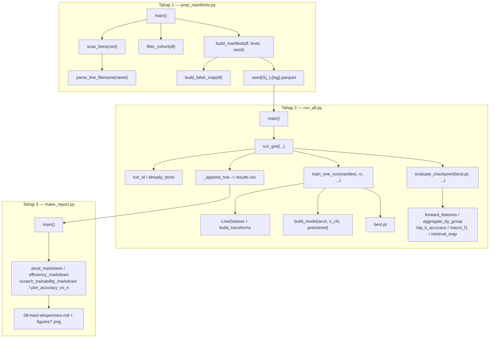

# Alur Kode Training — dari Entry Point sampai Laporan

Dokumen ini menelusuri jalannya kode **dari fungsi ke fungsi**, mulai dari
perintah yang diketik di terminal sampai angka yang masuk ke
`results/results.csv` dan tabel di `dokumentasi/08-hasil-eksperimen.md`.
Fokusnya pada *bagaimana* pipeline dieksekusi (siapa memanggil siapa, data apa
yang mengalir); alasan ilmiah di balik pilihan desain ada di
`07b-metodologi-eksperimen.md`.

Semua referensi ditulis sebagai `file:baris` agar bisa langsung dibuka.

---

## 1. Peta Singkat

Pipeline dijalankan lewat tiga perintah berurutan, masing-masing punya entry
point sendiri di `scripts/`:

```bash
python scripts/prep_manifests.py   # Tahap 1: dataset  -> manifest parquet
python scripts/run_all.py          # Tahap 2: manifest -> training + evaluasi -> results.csv
python scripts/make_report.py      # Tahap 3: results.csv -> tabel + grafik
```

Logika sebenarnya tinggal di package `src/cvl/`; skrip di `scripts/` hanya
tipis — membaca konfigurasi, lalu memanggil fungsi package.

| Modul | Tanggung jawab |
|---|---|
| `src/cvl/config.py` | konstanta global + seleksi grid dari `.env` |
| `src/cvl/data_prep.py` | scan dataset, saring kohort, bikin split manifest |
| `src/cvl/dataset.py` | `Dataset` PyTorch + transformasi/augmentasi |
| `src/cvl/models.py` | bikin model `timm`, ekstraksi fitur, hitung parameter |
| `src/cvl/train.py` | loop training satu *run* |
| `src/cvl/evaluate.py` | evaluasi checkpoint pada set uji |
| `src/cvl/metrics.py` | agregasi halaman, top-k, macro-F1, mAP retrieval |
| `src/cvl/run_experiments.py` | orkestrasi grid + tulis baris hasil |
| `src/cvl/report.py` | ringkasan tabel Markdown + plot |

### Diagram pemanggilan



---

## 2. Tahap 0 — Konfigurasi (dieksekusi saat import)

Sebelum fungsi apa pun dipanggil, `src/cvl/config.py` sudah berjalan sekali
saat modul di-import. Urutannya:

1. **`_load_dotenv()`** (`config.py:31`) — membaca `.env` di root repo baris per
   baris dan menaruhnya ke `os.environ` lewat `setdefault`. Karena
   `setdefault` tidak menimpa, variabel yang sudah ada di *environment* tetap
   menang: `CVL_MODES=pretrained python scripts/run_all.py` mengalahkan isi
   `.env`.
2. **`_env_list(name, default)`** (`config.py:46`) — memecah string berkoma jadi
   list; kosong/tidak ada → pakai default (grid penuh).
3. Hasilnya menjadi konstanta modul yang dibaca skrip:
   - `ARCHITECTURES` — subset dari `ALL_ARCHITECTURES` (`config.py:11`), memetakan
     kunci pendek (`resnet50`) ke nama model `timm`
     (`swin_tiny_patch4_window7_224`).
   - `ABLATION_LEVELS` — token level lewat **`_parse_level`** (`config.py:53`),
     yang menerjemahkan `"full"`/`"none"` menjadi `None` dan sisanya menjadi
     `int`. **`None` berarti "pakai semua halaman"** dan konvensi ini dipakai
     konsisten sampai ke `build_manifest` dan `RunConfig`.
   - `SEEDS`, `MODES`, `MAX_WRITERS`, dan override epoch/batch (`_env_int`,
     `config.py:57`).

Konstanta lain yang dipakai lintas modul: `EXCLUDE_WRITERS = {"0431", "0161"}`,
`MIN_PAGES = 5`, `IMAGE_SIZE = 224`, serta mean/std ImageNet.

---

## 3. Tahap 1 — Membangun Manifest

Entry point: **`scripts/prep_manifests.py:main`**.

### 3.1 `scan_lines(root)` — `data_prep.py:16`

Menjelajahi `cvl-database-1-1/` dengan `rglob("*.tif")`. Dua penyaring:

- Berkas diabaikan bila tidak ada folder bernama `lines` di antara parent-nya —
  ini yang membuat `words/`, `pages/`, dan `xml/` tidak ikut terbaca.
- Nama berkas diurai oleh **`parse_line_filename(name)`** (`data_prep.py:9`)
  dengan regex `^(\d+)-(\d+)-(\d+)\.tif$` → `(writer, page, line)`. Nama yang
  tidak cocok memicu `ValueError` yang ditangkap dan barisnya dilewati.

Keluaran: `DataFrame` dengan kolom `writer, page, line, path` (path absolut).

### 3.2 `filter_cohort(df)` — `data_prep.py:28`

Membentuk kohort final dalam dua langkah: buang penulis di `EXCLUDE_WRITERS`,
lalu hitung `nunique` halaman per penulis dan pertahankan yang `>= MIN_PAGES`.
Mengembalikan `(kept, info)`; `info["n_kept_writers"]` dan
`info["dropped_writers"]` dicetak ke stdout — angka inilah yang menjadi **jumlah
kelas final (308)** di bab metodologi.

Setelah ini `main` menerapkan `MAX_WRITERS` bila diset (memotong kohort untuk
smoke test cepat).

### 3.3 `build_manifest(df, n_train_pages, seed)` — `data_prep.py:47`

Dipanggil sekali untuk **setiap kombinasi seed × level**, jadi total
`len(SEEDS) × len(ABLATION_LEVELS)` berkas parquet.

Pertama **`build_label_map(df)`** (`data_prep.py:41`) memetakan writer terurut →
indeks `0..N-1`. Karena bersumber dari `sorted(unique)`, pemetaan ini stabil
lintas seed. Lalu `rng = np.random.default_rng(seed)` — RNG lokal, tidak
mengganggu state global.

Untuk **tiap penulis** (`groupby("writer")`):

1. Halaman diurutkan dengan **`_page_sort_key`** (`data_prep.py:44`) — numerik
   bila digit, leksikal bila tidak.
2. `test_p` = **halaman terakhir** (`pages[-test_pages:]`, default 1 halaman).
   Karena pengurutan deterministik dan tidak melibatkan RNG, **set uji identik
   di semua seed dan semua level** — inilah yang membuat perbandingan adil.
3. `pool` = halaman sisanya. `chosen` = `n_train_pages` halaman pertama dari
   `rng.permutation(pool)`; bila `n_train_pages is None` (level `full`), seluruh
   pool dipakai.
4. Kolom `label` dan `split` ditulis: default `"unused"`, halaman uji → `"test"`,
   halaman terpilih → `"train"`.
5. Validasi: 10% baris latih (minimal 1, dan 0 bila baris latih cuma 1) dipilih
   acak dari indeks `train_lines`, lalu di-*overwrite* menjadi `"val"`. Jadi
   **val adalah subset dari train yang dipindahkan**, bukan tambahan.
6. Baris `"unused"` dibuang sebelum di-concat.

Hasil akhir ditulis `main` ke `results/manifests/seed{S}_L{tag}.parquet`, dengan
`tag = "full"` bila level `None`.

> **Manifest adalah kontrak antar tahap.** Setelah tahap ini, dataset di disk
> tidak pernah di-scan lagi — training hanya membaca kolom
> `path, label, split, writer, page`.

---

## 4. Tahap 2 — Menjalankan Grid

Entry point: **`scripts/run_all.py:main`** (`run_all.py:13`).

Yang dikerjakan sebelum menyerahkan kendali:

1. Muat `configs/default.yaml` menjadi dict `hp` (batch size, epoch, LR, warmup,
   patience, num_workers, AMP).
2. Terapkan override `.env` yang sudah di-parse `config.py`
   (`CVL_PRETRAINED_EPOCHS`, `CVL_SCRATCH_EPOCHS`, `CVL_BATCH_SIZE`).
3. Pilih device: `"cuda"` bila tersedia, selain itu `"cpu"`.
4. **Muat semua manifest lebih dulu** ke dict bersarang
   `by_seed_level[seed][level]`, supaya parquet tidak dibaca ulang tiap run.
5. Panggil `run_grid(...)`.

### 4.1 `run_grid(...)` — `run_experiments.py:30`

Empat loop bersarang dengan urutan **seed → level → arch → mode**. Manifest
diambil sekali per (seed, level) di loop luar, lalu dipakai bersama oleh semua
arch/mode di dalamnya. Untuk tiap kombinasi:

1. **`run_id(arch, level, mode, seed)`** (`run_experiments.py:14`) menghasilkan
   identitas kanonik, mis. `resnet50_L3_pretrained_s0` atau
   `vit_small_Lfull_scratch_s2`. String ini dipakai untuk tiga hal sekaligus:
   nama folder checkpoint, kunci dedup di CSV, dan prefiks log.
2. **`already_done(results_csv, rid)`** (`run_experiments.py:18`) membaca
   `results.csv` dan mengecek keanggotaan `rid` di kolom `run_id`. Inilah
   mekanisme **resume**: sesi GPU yang putus cukup dijalankan ulang dengan
   perintah yang sama, run yang sudah tercatat akan dicetak `skip <rid>` dan
   dilewati.
3. Pilih epoch berdasarkan mode: `hp["pretrained_epochs"]` (40) atau
   `hp["scratch_epochs"]` (150).
4. Pilih LR lewat **`LR_OVERRIDES`** (`run_experiments.py:10`) — dict
   `(arch, mode) -> lr`. Saat ini hanya `("convnext_tiny", "pretrained") -> 1e-4`,
   karena ConvNeXt-Tiny divergen pada LR basis `3e-4`. Bila override aktif, fakta
   itu dicetak ke log agar terekam di transkrip run.
5. Bungkus semuanya jadi **`RunConfig`** (`train.py:10`) — dataclass berisi
   `arch, level, mode, seed, epochs, lr, batch_size, weight_decay`.
6. `train_one_run(...)` → `evaluate_checkpoint(...)` → `_append_row(...)`.

### 4.2 `train_one_run(manifest, rc, out_dir, device, hp)` — `train.py:27`

Inti pipeline. Urutan eksekusinya:

**a. Determinisme.** **`_seed_all(rc.seed)`** (`train.py:21`) menyetel
`np.random.seed` dan `torch.manual_seed`. Ini mengontrol inisialisasi bobot
(khususnya penting untuk mode `scratch`), urutan shuffle DataLoader, dan
augmentasi. Perlu dicatat bahwa seed di sini **berbeda peran** dari seed di
`build_manifest`: yang itu mengontrol *pemilihan halaman*, yang ini mengontrol
*proses training*. Keduanya memakai angka yang sama, sehingga satu seed
menentukan satu eksperimen utuh.

**b. Data.** Manifest disaring per split lalu dibungkus:

```python
train_ds = LineDataset(manifest[manifest.split == "train"], train=True)
val_ds   = LineDataset(manifest[manifest.split == "val"],   train=False)
```

**`LineDataset.__init__`** (`dataset.py:24`) me-reset index dan memanggil
**`build_transforms(train)`** (`dataset.py:6`) satu kali:

- `train=True` → Grayscale(3 kanal) → Resize(224) → RandomAffine(±3°, translasi
  2%, skala 0,95–1,05) → RandomResizedCrop(224) → ColorJitter → ToTensor →
  Normalize(ImageNet). **Tidak ada horizontal flip** — membalik tulisan merusak
  identitas penulis.
- `train=False` → Grayscale(3) → Resize(224) → CenterCrop(224) → ToTensor →
  Normalize. Deterministik, dipakai val maupun test.

**`__getitem__`** (`dataset.py:32`) barulah membuka berkas dari disk
(`Image.open(path).convert("RGB")`) dan mengembalikan `(tensor, int(label))` —
jadi I/O terjadi *lazy* per batch, bukan di awal.

Keduanya dibungkus `DataLoader`: train `shuffle=True`, val `shuffle=False`,
`num_workers` dari `hp` (8 di GPU).

**c. Model.** **`build_model(arch, _num_classes(manifest), pretrained=(rc.mode == "pretrained"))`**
(`models.py:5`) meneruskan ke `timm.create_model` dengan `num_classes` yang
otomatis mengganti head klasifikasi. **`_num_classes`** (`train.py:24`) dihitung
sebagai `manifest["label"].max() + 1` — dari manifest penuh, bukan per split,
supaya head tetap 308 kelas walau suatu split kebetulan tidak memuat semua label.
Satu-satunya beda `pretrained` vs `scratch` di level kode adalah **flag boolean
ini**; sisa resepnya identik.

**d. Optimizer dan scheduler.** AdamW (`lr=rc.lr`, `weight_decay=rc.weight_decay`).
Penjadwal LR dirakit dua tahap (`train.py:39-48`):

```python
warmup_epochs = min(int(hp.get("warmup_epochs", 3)), max(0, rc.epochs - 1))
```

Klausa `min(...)` melindungi run pendek — pada smoke test 2 epoch, warmup
otomatis mengecil jadi 1 sehingga `CosineAnnealingLR` tetap punya `T_max >= 1`.
Bila `warmup_epochs > 0`, `LinearLR(start_factor=0.01)` dan `CosineAnnealingLR`
digabung dengan `SequentialLR` bermilestone di akhir warmup; bila 0, cosine
langsung. Warmup ini bukan detail kosmetik: tanpanya ConvNeXt-T dan Swin-T
divergen di epoch awal lalu kolaps ke prediksi satu kelas.

**e. AMP.** `use_amp = hp["amp"] and device != "cpu"` — mixed precision otomatis
mati di CPU sehingga test lokal tetap jalan. `GradScaler` dibuat dengan
`enabled=use_amp`; saat nonaktif, `scaler.scale/step/update` menjadi *pass-through*,
jadi baris loop-nya tidak perlu bercabang.

**f. Loop epoch** (`train.py:57-88`). Per epoch:

1. `model.train()`, lalu untuk tiap batch: pindah ke device → `opt.zero_grad()` →
   forward di dalam `autocast` → `crit(model(x), y)` (CrossEntropy) →
   `scaler.scale(loss).backward()` → `scaler.step(opt)` → `scaler.update()`.
   `loss_sum` diakumulasi dengan bobot `len(x)` agar rerata benar walau batch
   terakhir lebih kecil.
2. `sched.step()` — **per epoch**, bukan per batch; konsisten dengan
   `total_iters`/`T_max` yang dihitung dalam satuan epoch.
3. `model.eval()` + `torch.no_grad()` untuk validasi: hitung akurasi **level
   baris** (`argmax(1) == y`). Perhatikan bahwa agregasi ke level halaman hanya
   dilakukan saat evaluasi akhir, tidak di sini.
4. Bila `acc > best_acc`: simpan `best_acc`, salin `state_dict` ke CPU
   (`{k: v.cpu() ...}` — supaya checkpoint tidak menahan memori GPU), reset
   `bad = 0`. Bila tidak: `bad += 1`.
5. Cetak satu baris log berprefiks `tag` (`{arch}_L{lvl}_{mode}_s{seed}`) berisi
   loss, val_acc, best, `patience=bad/patience`, dan elapsed — inilah baris yang
   terlihat di `run.log`/`rerun_*.log`.
6. **Early stopping**: `break` bila `bad >= patience` (default 8).

**g. Simpan.** `torch.save(best_state or model.state_dict(), out_dir/"best.pt")` —
fallback `or` menutup kasus tepi ketika tidak ada epoch yang pernah "improved".

Mengembalikan dict: `{"best_val_acc", "train_time_s", "epochs_ran"}`.

### 4.3 `evaluate_checkpoint(ckpt, manifest, arch, device, batch_size)` — `evaluate.py:13`

Dipanggil `run_grid` tepat setelah training, memakai `out_dir/"best.pt"`.

1. Ambil split `test` dari manifest yang **sama** dengan yang dipakai training.
2. `build_model(arch, n_cls, pretrained=False)` — **selalu `False`**, karena bobot
   akan segera ditimpa `load_state_dict`; mengunduh bobot ImageNet di sini hanya
   buang waktu. Lalu `model.eval()`.
3. `LineDataset(test, train=False)` → transformasi deterministik, `shuffle=False`
   supaya urutan baris cocok dengan urutan `test["label"]`.
4. Loop `no_grad` mengumpulkan dua hal per batch:
   - `probs` — `softmax(model(x))`, untuk metrik klasifikasi.
   - `feats` — **`forward_features(model, x)`** (`models.py:10`), untuk metrik
     retrieval. Fungsi ini menormalkan bentuk keluaran lintas arsitektur: peta
     fitur CNN `[B,C,H,W]` dan token transformer `[B,N,D]` sama-sama diringkas
     menjadi `[B,D]` lewat `model.forward_head(feats, pre_logits=True)` bila
     tersedia, atau rata-rata dimensi spasial sebagai fallback.
   `n_img` dan waktu dicatat untuk `throughput_img_s` (diukur pada inferensi test,
   sudah termasuk transfer host→device).
5. **Agregasi ke halaman.** `page_groups = writer + "|" + page`;
   **`aggregate_by_group(probs, groups)`** (`metrics.py:4`) merata-ratakan
   softmax semua baris dalam satu halaman → `(gids, page_probs)`. `page_labels`
   diambil dari label pertama tiap grup (semua baris satu halaman pasti sekelas).
6. **Metrik.**
   - **`top_k_accuracy(page_probs, page_labels, k)`** (`metrics.py:9`) untuk k=1
     dan k=5 (dijaga `min(5, n_cls)`).
   - **`macro_f1(page_probs, page_labels)`** (`metrics.py:14`) — `f1_score`
     sklearn dengan `average="macro"`, jadi tiap penulis berbobot sama.
   - **`retrieval_map(feats, labels)`** (`metrics.py:18`) — bekerja di **level
     baris**, bukan halaman. Fitur dinormalisasi L2, matriks kemiripan kosinus
     `f @ f.T`, diagonal diisi `-inf` supaya baris tidak me-retrieve dirinya
     sendiri, lalu untuk tiap query: urutkan menurun, buang elemen terakhir (si
     `-inf` diri sendiri), hitung Average Precision dari posisi hit. Mengembalikan
     `(mAP, top1_retrieval)`.
   - **`count_params(model)`** (`models.py:19`).

Mengembalikan dict tujuh metrik: `top1_page, top5_page, macro_f1_page, map_line,
top1_retrieval, n_params, throughput_img_s`.

### 4.4 `_append_row(results_csv, row)` — `run_experiments.py:25`

`run_grid` menggabungkan tiga sumber menjadi satu baris:

```python
{"run_id": rid, "arch": arch, "level": ..., "mode": mode, "seed": seed, **tr, **ev}
```

`level` dinormalkan kembali: `None` ditulis sebagai string `"full"` agar CSV
terbaca. Penulisan memakai `mode="a"` dengan `header=not p.exists()` —
**append per run, bukan tulis-ulang di akhir**. Konsekuensinya penting: hasil
sudah aman di disk begitu satu run selesai, dan inilah yang membuat
`already_done` bisa melakukan resume. Terakhir dicetak
`done <rid>: top1=... map=...`.

---

## 5. Tahap 3 — Laporan

Entry point: **`scripts/make_report.py:main`** (`make_report.py:13`), membaca
`results/results.csv` dan merangkai Markdown.

Fondasinya **`summarize(df)`** (`report.py:8`): `groupby(["arch","level","mode"])`
lalu `agg(["mean","std"])` — di sinilah **3 seed diringkas menjadi mean±std**.

- **`pivot_markdown(df, metric, mode, exclude_levels)`** (`report.py:17`) —
  tabel arch × level untuk satu metrik. Level diurutkan `_level_order`
  (`report.py:14`) yang memetakan `"full"` → 999 agar selalu di kanan.
  `make_report.py` memanggilnya dengan `DROP = ("full",)` untuk mode pretrained,
  karena ukuran data `full` praktis sama dengan L4.
- **`scratch_trainability_markdown(df, level="full", ...)`** (`report.py:37`) —
  sengaja **tidak** merata-ratakan seed, melainkan menampilkan per-seed plus
  kolom `kolaps` (jumlah seed dengan `top1 < 0.05`, artinya prediksi ~1 kelas).
  Ini memisahkan pertanyaan *stabilitas* dari *akurasi*: rerata saja akan
  menyembunyikan fakta bahwa Swin-T kolaps di 3/3 seed.
- **`efficiency_markdown(df, mode)`** (`report.py:60`) — rerata `n_params`,
  `throughput_img_s`, `train_time_s` per arsitektur.
- **`plot_accuracy_vs_n(df, mode, out_png, exclude_levels)`** (`report.py:72`) —
  kurva Top-1 vs N per arsitektur dengan errorbar std → `results/figures/*.png`.
  Backend matplotlib dipaksa `"Agg"` di `report.py:1` supaya jalan di server tanpa
  display.

Output ditulis ke `dokumentasi/08-hasil-eksperimen.md`.

---

## 6. Ringkasan Fungsi

| Fungsi | Lokasi | Masukan → Keluaran | Dipanggil dari |
|---|---|---|---|
| `_load_dotenv` | `config.py:31` | `.env` → `os.environ` | saat import `config` |
| `parse_line_filename` | `data_prep.py:9` | nama berkas → `(writer, page, line)` | `scan_lines` |
| `scan_lines` | `data_prep.py:16` | root dataset → DataFrame baris | `prep_manifests.main` |
| `filter_cohort` | `data_prep.py:28` | DataFrame → `(kept, info)` | `prep_manifests.main` |
| `build_label_map` | `data_prep.py:41` | DataFrame → `{writer: idx}` | `build_manifest` |
| `build_manifest` | `data_prep.py:47` | kohort + level + seed → manifest ber-`split` | `prep_manifests.main` |
| `run_grid` | `run_experiments.py:30` | manifest + grid + hp → (efek samping CSV) | `run_all.main` |
| `run_id` | `run_experiments.py:14` | 4 komponen → string identitas | `run_grid` |
| `already_done` | `run_experiments.py:18` | CSV + rid → bool | `run_grid` |
| `train_one_run` | `train.py:27` | manifest + `RunConfig` → `{best_val_acc, train_time_s, epochs_ran}` + `best.pt` | `run_grid` |
| `_seed_all` | `train.py:21` | seed → (state RNG global) | `train_one_run` |
| `build_transforms` | `dataset.py:6` | flag `train` → `Compose` | `LineDataset.__init__` |
| `LineDataset.__getitem__` | `dataset.py:32` | idx → `(tensor, label)` | DataLoader |
| `build_model` | `models.py:5` | arch + n_cls + pretrained → model `timm` | `train_one_run`, `evaluate_checkpoint` |
| `evaluate_checkpoint` | `evaluate.py:13` | `best.pt` + manifest → 7 metrik | `run_grid` |
| `forward_features` | `models.py:10` | model + batch → embedding `[B, D]` | `evaluate_checkpoint` |
| `aggregate_by_group` | `metrics.py:4` | probs baris + grup → probs halaman | `evaluate_checkpoint` |
| `retrieval_map` | `metrics.py:18` | fitur + label → `(mAP, top1)` | `evaluate_checkpoint` |
| `_append_row` | `run_experiments.py:25` | dict → append `results.csv` | `run_grid` |
| `summarize` | `report.py:8` | results → mean±std per (arch, level, mode) | fungsi tabel/plot |

---

## 7. Titik Masuk untuk Modifikasi

| Ingin mengubah… | Sentuh di sini |
|---|---|
| Tambah arsitektur | `ALL_ARCHITECTURES` (`config.py:11`) — cukup tambah kunci → nama `timm` |
| Aturan kohort (writer dibuang, min halaman) | `EXCLUDE_WRITERS` / `MIN_PAGES` (`config.py:4-5`), lalu **jalankan ulang `prep_manifests.py`** |
| Augmentasi | `build_transforms` (`dataset.py:6`) |
| Hyperparameter (epoch, LR, batch, patience, warmup) | `configs/default.yaml`; sementara/per-run lewat `.env` |
| LR khusus satu arsitektur | `LR_OVERRIDES` (`run_experiments.py:10`) |
| Aturan split / rasio validasi | `build_manifest` (`data_prep.py:47`) — ubah `test_pages`/`val_frac`, lalu regenerasi manifest |
| Metrik baru | tambah di `metrics.py`, panggil dari `evaluate_checkpoint`, lalu daftarkan di `_METRICS` (`report.py:6`) |

Dua jebakan yang perlu diingat:

- **Manifest tidak dibangun ulang otomatis.** Perubahan apa pun yang menyentuh
  kohort atau split baru berlaku setelah `prep_manifests.py` dijalankan lagi.
- **`results.csv` bersifat append-only dan menjadi sumber kebenaran `already_done`.**
  Untuk menjalankan ulang run yang sudah tercatat, hapus barisnya (atau seluruh
  berkasnya) lebih dulu — kalau tidak, run itu akan terus di-`skip`.

Verifikasi lokal tanpa GPU/dataset: `.venv/bin/pytest -q` menjalankan seluruh
alur di atas dengan fixture kecil di CPU (lihat `tests/test_train_smoke.py` dan
`tests/conftest.py`).
