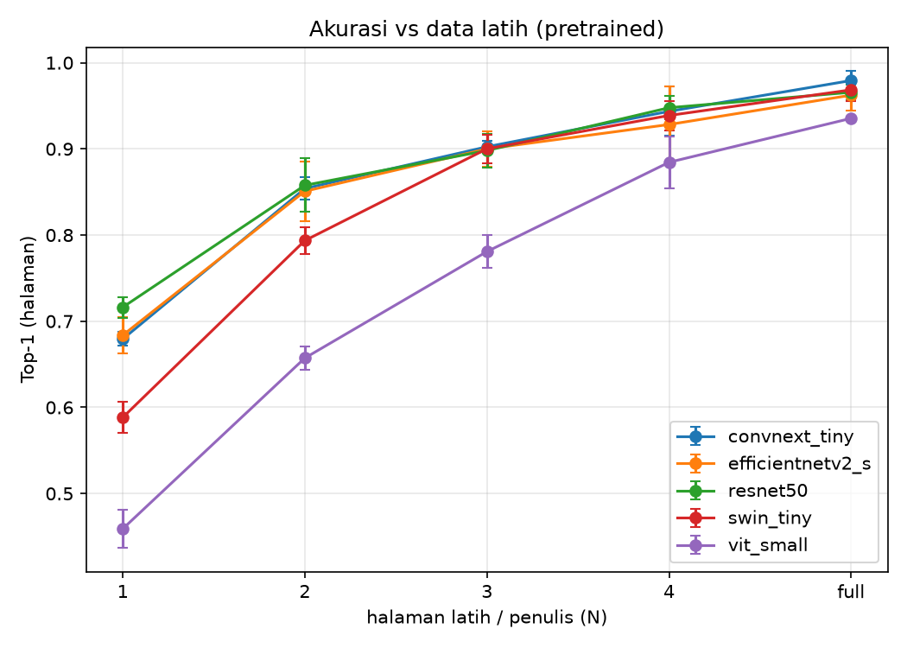
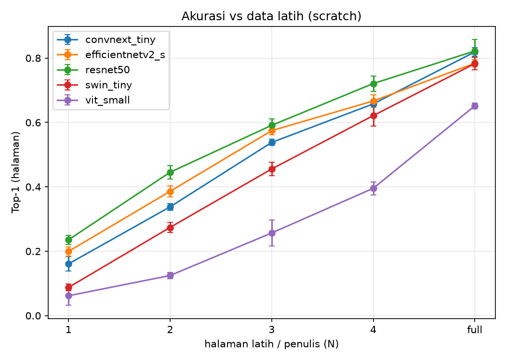

# CONTOH Hasil Eksperimen — Perbandingan Arsitektur Writer-ID CVL

> ⚠️ **DATA SINTETIS / DUMMY** — file ini hanya contoh WUJUD laporan, bukan hasil sungguhan. Dibuat dengan angka buatan agar kamu bisa melihat bentuk tabel & grafik sebelum grid asli selesai. Laporan asli nanti otomatis dibuat `python scripts/make_report.py` ke `dokumentasi/08-hasil-eksperimen.md`.

## Mode: pretrained

### Top-1 (halaman)

| arch | N=1 | N=2 | N=3 | N=4 | N=full |
|---|---|---|---|---|---|
| convnext_tiny | 0.679±0.008 | 0.854±0.013 | 0.902±0.007 | 0.944±0.029 | 0.979±0.011 |
| efficientnetv2_s | 0.684±0.021 | 0.851±0.035 | 0.900±0.021 | 0.928±0.044 | 0.962±0.018 |
| resnet50 | 0.716±0.012 | 0.858±0.031 | 0.898±0.020 | 0.948±0.013 | 0.966±0.009 |
| swin_tiny | 0.588±0.018 | 0.794±0.015 | 0.900±0.017 | 0.939±0.017 | 0.969±0.013 |
| vit_small | 0.459±0.022 | 0.657±0.014 | 0.781±0.019 | 0.884±0.030 | 0.935±0.002 |

### Top-5 (halaman)

| arch | N=1 | N=2 | N=3 | N=4 | N=full |
|---|---|---|---|---|---|
| convnext_tiny | 0.869±0.004 | 0.936±0.004 | 0.956±0.013 | 0.986±0.007 | 0.978±0.005 |
| efficientnetv2_s | 0.879±0.018 | 0.939±0.006 | 0.963±0.008 | 0.971±0.022 | 0.992±0.009 |
| resnet50 | 0.881±0.003 | 0.942±0.010 | 0.959±0.014 | 0.973±0.011 | 0.980±0.008 |
| swin_tiny | 0.836±0.025 | 0.913±0.005 | 0.963±0.012 | 0.974±0.012 | 0.985±0.015 |
| vit_small | 0.783±0.011 | 0.871±0.018 | 0.903±0.023 | 0.944±0.024 | 0.972±0.013 |

### Macro-F1 (halaman)

| arch | N=1 | N=2 | N=3 | N=4 | N=full |
|---|---|---|---|---|---|
| convnext_tiny | 0.657±0.009 | 0.824±0.010 | 0.874±0.004 | 0.918±0.022 | 0.949±0.012 |
| efficientnetv2_s | 0.661±0.032 | 0.826±0.028 | 0.874±0.023 | 0.908±0.047 | 0.939±0.029 |
| resnet50 | 0.697±0.022 | 0.832±0.025 | 0.870±0.019 | 0.917±0.009 | 0.933±0.008 |
| swin_tiny | 0.565±0.022 | 0.779±0.002 | 0.871±0.015 | 0.912±0.027 | 0.933±0.014 |
| vit_small | 0.449±0.013 | 0.641±0.008 | 0.753±0.026 | 0.862±0.039 | 0.917±0.005 |

### mAP (retrieval, baris)

| arch | N=1 | N=2 | N=3 | N=4 | N=full |
|---|---|---|---|---|---|
| convnext_tiny | 0.341±0.025 | 0.433±0.023 | 0.456±0.021 | 0.478±0.028 | 0.482±0.007 |
| efficientnetv2_s | 0.312±0.012 | 0.428±0.020 | 0.450±0.030 | 0.467±0.019 | 0.488±0.024 |
| resnet50 | 0.375±0.006 | 0.431±0.003 | 0.456±0.013 | 0.467±0.019 | 0.497±0.013 |
| swin_tiny | 0.292±0.017 | 0.394±0.013 | 0.436±0.022 | 0.475±0.010 | 0.476±0.017 |
| vit_small | 0.220±0.036 | 0.322±0.027 | 0.385±0.023 | 0.446±0.008 | 0.463±0.028 |

### Efisiensi (rata-rata lintas level/seed)

| arch | n_params | throughput_img_s | train_time_s |
|---|---|---|---|
| convnext_tiny | 28600000.000 | 357.669 | 34.560 |
| efficientnetv2_s | 21500000.000 | 300.821 | 33.487 |
| resnet50 | 25600000.000 | 478.843 | 34.313 |
| swin_tiny | 28300000.000 | 350.489 | 34.207 |
| vit_small | 22000000.000 | 561.327 | 33.787 |

## Mode: scratch

### Top-1 (halaman)

| arch | N=1 | N=2 | N=3 | N=4 | N=full |
|---|---|---|---|---|---|
| convnext_tiny | 0.161±0.023 | 0.338±0.011 | 0.538±0.010 | 0.658±0.007 | 0.819±0.014 |
| efficientnetv2_s | 0.199±0.014 | 0.386±0.017 | 0.575±0.012 | 0.667±0.019 | 0.784±0.012 |
| resnet50 | 0.235±0.014 | 0.445±0.020 | 0.591±0.020 | 0.721±0.024 | 0.822±0.036 |
| swin_tiny | 0.088±0.011 | 0.274±0.015 | 0.455±0.021 | 0.621±0.033 | 0.783±0.019 |
| vit_small | 0.062±0.029 | 0.125±0.010 | 0.257±0.040 | 0.396±0.020 | 0.652±0.009 |

### Top-5 (halaman)

| arch | N=1 | N=2 | N=3 | N=4 | N=full |
|---|---|---|---|---|---|
| convnext_tiny | 0.660±0.017 | 0.730±0.018 | 0.814±0.007 | 0.863±0.011 | 0.934±0.012 |
| efficientnetv2_s | 0.678±0.013 | 0.745±0.015 | 0.852±0.008 | 0.860±0.015 | 0.908±0.004 |
| resnet50 | 0.702±0.001 | 0.776±0.011 | 0.841±0.010 | 0.885±0.012 | 0.927±0.025 |
| swin_tiny | 0.631±0.015 | 0.711±0.004 | 0.783±0.014 | 0.843±0.018 | 0.923±0.004 |
| vit_small | 0.623±0.009 | 0.642±0.006 | 0.708±0.015 | 0.754±0.012 | 0.864±0.006 |

### Macro-F1 (halaman)

| arch | N=1 | N=2 | N=3 | N=4 | N=full |
|---|---|---|---|---|---|
| convnext_tiny | 0.161±0.019 | 0.325±0.009 | 0.522±0.017 | 0.634±0.015 | 0.792±0.021 |
| efficientnetv2_s | 0.188±0.008 | 0.370±0.025 | 0.555±0.014 | 0.647±0.021 | 0.755±0.010 |
| resnet50 | 0.233±0.008 | 0.434±0.003 | 0.573±0.025 | 0.686±0.027 | 0.804±0.041 |
| swin_tiny | 0.085±0.016 | 0.268±0.016 | 0.440±0.025 | 0.600±0.047 | 0.763±0.019 |
| vit_small | 0.054±0.033 | 0.121±0.009 | 0.253±0.038 | 0.379±0.023 | 0.631±0.008 |

### mAP (retrieval, baris)

| arch | N=1 | N=2 | N=3 | N=4 | N=full |
|---|---|---|---|---|---|
| convnext_tiny | 0.081±0.013 | 0.156±0.016 | 0.262±0.009 | 0.321±0.026 | 0.406±0.036 |
| efficientnetv2_s | 0.094±0.012 | 0.194±0.013 | 0.293±0.034 | 0.336±0.009 | 0.393±0.009 |
| resnet50 | 0.101±0.010 | 0.228±0.043 | 0.272±0.012 | 0.374±0.019 | 0.389±0.015 |
| swin_tiny | 0.035±0.027 | 0.129±0.008 | 0.218±0.025 | 0.325±0.014 | 0.407±0.008 |
| vit_small | 0.042±0.015 | 0.065±0.020 | 0.129±0.048 | 0.202±0.019 | 0.335±0.010 |

### Efisiensi (rata-rata lintas level/seed)

| arch | n_params | throughput_img_s | train_time_s |
|---|---|---|---|
| convnext_tiny | 28600000.000 | 360.182 | 128.873 |
| efficientnetv2_s | 21500000.000 | 295.791 | 129.453 |
| resnet50 | 25600000.000 | 479.960 | 124.867 |
| swin_tiny | 28300000.000 | 349.848 | 127.587 |
| vit_small | 22000000.000 | 556.387 | 128.200 |

